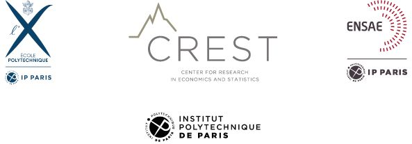

# Computer Sciences Research Project

## Project: Analysis of city composition based on basic amenities including public transport

Please find the project report in the following [file](https://drive.google.com/file/d/1H4NBf4-vHgr995r3bvlePJXWFkzVVDNR/view?usp=sharing)

### 1. Overview

--- 

This project is the extension work of the ENSAE BATO-MOUCHE project by Simon GENET, Leopold MAURICE, and Marie-Olive THAURY. Please find the Github webpage of their work in this [link](https://github.com/LeoMaurice/BATO-MOUCHE-Stat-App). In our project, we introduce public transport as consideration and we build the 2SFCA method and TOP degree measurement based on it.

The project is supervised by Prof. Sarah J. Berkemer.

### 2. Dataset and Result

---
Providing links and resources that can assist in accessing the fundamental databases required to run this project.
1. **Filosofi dataset:** [Données carroyées – Carreau de 200m](https://www.insee.fr/fr/statistiques/4176290?sommaire=4176305#consulter). Here we mainly use the dataset with the name of **Carreau 200m – Geopackage – Métropole - Martinique - La Réunion**. Or you can download it more straightforward through this [link](https://drive.google.com/drive/folders/1wpwrlVyq3imUojd2cAJYNAjXZcGhA7cr?usp=sharing). Then also provide the dataset with 1km × 1km grid in [Données carroyées – Carreau de 1km](https://www.insee.fr/fr/statistiques/4176293?sommaire=4176305). You can find all the explanation for the variables in this [webpage](https://www.insee.fr/fr/statistiques/4176290?sommaire=4176305#dictionnaire).

2. **OSMnx documentation:** [https://osmnx.readthedocs.io/en/stable/](https://osmnx.readthedocs.io/en/stable/) - The document to introduce **OSMnx** package with Python.

3. **OpenStreetMap Wiki:** [https://wiki.openstreetmap.org/wiki/Main_Page](https://wiki.openstreetmap.org/wiki/Main_Page) - In this website, you can find the tags of each node, facility, amenity, transportation in the map, which you need those tags to absorb the data you need for the OSM.

4. **Geopandas:** [https://geopandas.org/en/stable/](https://geopandas.org/en/stable/)

5. **OSMnx:** OSMnx utilizes the Overpass API to access OpenStreetMap (OSM) data. It encapsulates this access, simplifying and rendering OSM network graphs more realistically. Additionally, OSMnx incorporates algorithms for network analysis. As of now, OSMnx stands as arguably the most efficient tool for accessing OSM data.

Since running the whole program for one time is quite long, we provide the result in `.csv` format [here](https://drive.google.com/drive/folders/1ucJszZOcDgbacrrGILFLS_E4nszXgChT?usp=drive_link).

### 3. Organization of the repository

---

1. [basicstatistics.py](https://github.com/yubocai-poly/BATO-MOUTCHE-Extension/blob/main/helpers/basicstatistics.py): Statistics tools and visualization functions.
2. [transportationtool.py](https://github.com/yubocai-poly/BATO-MOUTCHE-Extension/blob/main/helpers/transportationtool.py): Code implementation for the methodology section 3 in the report.
3. [TOD_analysis.ipynb](https://github.com/yubocai-poly/BATO-MOUTCHE-Extension/blob/main/transportation/TOD_analysis.ipynb): This is the result file of the time-of-day analysis section 4.2 in the report.
4. [accessibility_analysis.ipynb](https://github.com/yubocai-poly/BATO-MOUTCHE-Extension/blob/main/transportation/accessibility_analysis.ipynb): This is the result file of the aggregated results section 4.1 in the report.
5. [basic_stats.ipynb](https://github.com/yubocai-poly/BATO-MOUTCHE-Extension/blob/main/transportation/basic_stats.ipynb): All the basic statistics results of the public transportation in Paris.

### 4. More Information

---

For more details on resources and dataset description. Please check the [README.md](https://github.com/LeoMaurice/BATO-MOUCHE-Stat-App/blob/main/README.md) file.

### Reference

---

[1] Mark Abrahamson. *Globalizing Cities: A Brief Introduction*. Routledge, 2019.

[2] Geoff Boeing. “OSMnx: New methods for acquiring, constructing, analyzing, and visualizing complex street net-
works”. In: *Computers, Environment and Urban Systems* 65 (2017), pp. 126–139.

[3] Mordechai Haklay and Patrick Weber. “OpenStreetMap: User-Generated Street Maps”. In: *IEEE Pervasive Com-
puting* 7.4 (2008), pp. 12–18. DOI: [10.1109/MPRV.2008.80](https://ieeexplore.ieee.org/document/4653466/).

[4] Shunwei Ji et al. “How to find vacant green space in the process of urban park planning: case study in Ningbo
(China)”. In: *International Journal of Environmental Research and Public Health* 17.21 (2020), p. 8282.

[5] Huilin Liang et al. “Using an improved 3SFCA method to assess inequities associated with multimodal accessibility
to green spaces based on mismatches between supply and demand in the metropolitan of Shanghai, China”. In:
*Sustainable Cities and Society* 91 (2023), p. 104456.

[6] Wei Luo and Fahui Wang. “Measures of spatial accessibility to health care in a GIS environment: synthesis and a
case study in the Chicago region”. In: *Environment and planning B: planning and design* 30.6 (2003), pp. 865–884.

[7] Matthew R McGrail and John S Humphreys. “Measuring spatial accessibility to primary care in rural areas: Improv-
ing the effectiveness of the two-step floating catchment area method”. In: *Applied Geography* 29.4 (2009), pp. 533–
541.

[8] Carlos Moreno et al. “Introducing the “15-Minute City”: Sustainability, resilience and place identity in future post-
pandemic cities”. In: *Smart Cities* 4.1 (2021), pp. 93–111.

[9] Enrica Papa and Luca Bertolini. “Accessibility and transit-oriented development in European metropolitan areas”.
In: *Journal of Transport Geography* 47 (2015), pp. 70–83.

[10] R Shanmathi Rekha et al. “Accessibility analysis of health care facility using geospatial techniques”. In: *Transporta-
tion Research Procedia* 27 (2017), pp. 1163–1170.

[11] GENET Simon, MAURICE Leopold, and THAURY Marie-Olive. “Analysis of the composition of big cities around
Points-Of-Interest”. In: *ENSAE Stat’App Report* (2023).
